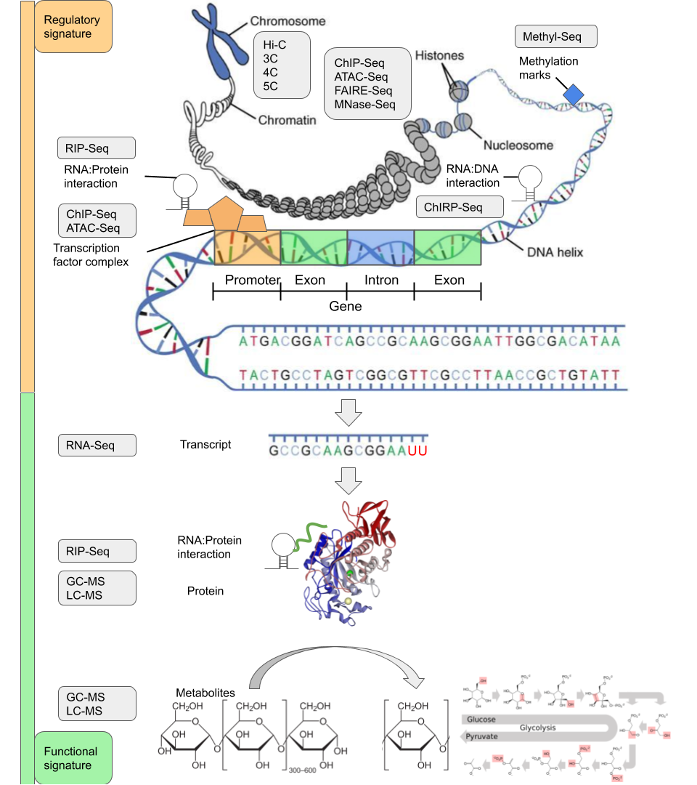

Tyrone was a bioinformatics PhD student at [Monash University, supervised by Dr Sonika Tyagi](https://bioinformaticslab.erc.monash.edu/). He works together with biologists, bioinformaticians and statisticians on developing and applying computational methods for identifying informative patterns in large biological datasets. [More specifically, his focus is on multi-omics data integration using machine and deep learning.](https://doi.org/10.1093/gigascience/giaa064)

Originally he was a laboratory biologist working on plant physiology and the molecular biology of non-coding RNA. He later got interested in bioinformatics, and for his honours project developed software for motif discovery using an information theory approach. He then worked as a bioinformatics research assistant in the Stemformatics project led by Professor Christine Wells, where he curated and processed several hundred transcriptomics datasets in an interdisciplinary environment to build a reference database for the community. He also teaches introductory programming and machine learning workshops as part of Software Carpentries, Monash Data Fluency and COMBINE. [A full list of his projects and publications is available for reference.](https://orcid.org/0000-0002-9207-0385)

[His software is open source and any contributions are welcome.](https://github.com/tyronechen) If you want to discuss method development, data analysis or the best restaurants within Melbourne, Malaysia and Singapore, please contact him directly.

<a class="twitter-timeline" data-width="800" data-height="640" href="https://twitter.com/_tyronechen?ref_src=twsrc%5Etfw">Tweets by _tyronechen</a> 
