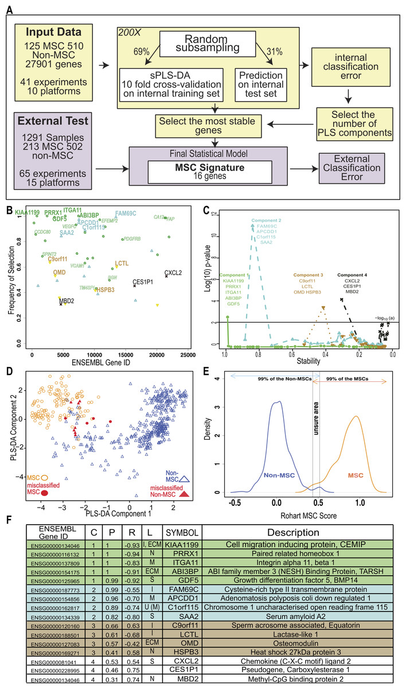

The Rohart MSC test is a simple in silico test that accurately discriminates MSC from fibroblasts, other adult stem/progenitor cell types or differentiated stromal cells. It has been implemented in the [www.stemformatics.org](www.stemformatics.org) resource, to assist researchers wishing to benchmark their own MSC datasets or data from the public domain.



*An improved in silico MSC signature.*

[Online version](https://doi.org/10.7717/peerj.1845)

[Download paper here](http://tyronechen.github.io/files/peerj-1845.pdf)

Plain text citation:

Florian Rohart, Elizabeth A. Mason, Nicholas Matigian, Rowland Mosbergen, Othmar Korn, Tyrone Chen, Suzanne Butcher, Jatin Patel, Kerry Atkinson, Kiarash Khosrotehrani, Nicholas M. Fisk, Kim-Anh Lê Cao, Christine A. Wells​, &quot;A molecular classification of human mesenchymal stromal cells.&quot; <i>PeerJ</i>, 2016, 4:e1845. DOI: https://doi.org/10.7717/peerj.1845

Bibtex citation:
```
@article{Rohart2016,
	author = {Rohart, F. and Mason, E.A. and Matigian, N. and Mosbergen, R. and Korn, O. and Chen, T. and Butcher, S. and Patel, J. and Atkinson, K. and Khosrotehrani, K. and Fisk, N.M. and Cao, K.L. and Wells, C.A.},
	doi = {10.7717/peerj.1845},
	issn = {21678359},
	journal = {PeerJ},
	keywords = {Data integration,Mesenchymal stromal cells,Meta-analysis,Sparse classification,Stem cell classification,Transcriptome},
	number = {3},
	title = {{A molecular classification of human mesenchymal stromal cells}},
	volume = {2016},
	year = {2016}
}
```
