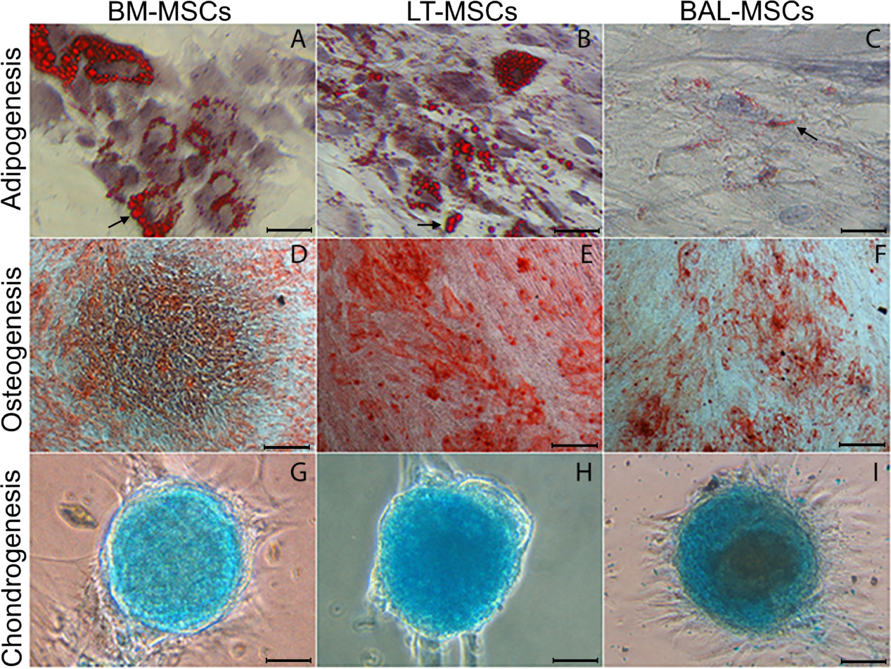

This investigation comprehensively characterizes and contrasts human lung derived mesenchymal stromal cells (MSCs) from tissue and bronchoalveolar lavage. MSCs isolated by bronchoalveolar lavage are rare in healthy individuals and express multiple hallmarks of fibrotic differentiation.



*Mesenchymal stromal cells isolated from BM‐MSCs and LT‐MSCs have a full capacity to differentiate into each mesenchymal lineage. In contrast, BAL‐MSCs are bipotent and lack adipogenic potential as indicated by their retention of a spindle shaped cell body and inability to develop large lipid vacuoles (black arrows, panels A–C).*

[Online version](https://doi.org/10.1002/stem.2419)

[Download paper here](http://tyronechen.github.io/files/stem.2419.pdf)

Plain text citation:

Kenneth A Sinclair, Stephanie T Yerkovich, Tyrone Chen, Jonathan L McQualter, Peter M-A Hopkins, Christine A Wells, Daniel C Chambers, &quot;Mesenchymal Stromal Cells are Readily Recoverable from Lung Tissue, but not the Alveolar Space, in Healthy Humans&quot; <i>Stem Cells</i>, 2016, 34: 2548-2558. DOI: https://doi.org/10.1002/stem.2419

Bibtex citation:

```
@article{doi:10.1002/stem.2419,
	author = {Sinclair, K. A. and Yerkovich, S. T. and Chen, T. and McQualter, J. L. and Hopkins, P. M-A. and Wells, C. A. and Chambers, D. C.},
	title = {Mesenchymal Stromal Cells are Readily Recoverable from Lung Tissue, but not the Alveolar Space, in Healthy Humans},
	journal = {STEM CELLS},
	volume = {34},
	number = {10},
	pages = {2548-2558},
	keywords = {Mesenchymal stromal cells, Mesenchymal stem cells, Lung, Transcriptome, Microarray},
	doi = {10.1002/stem.2419},
	url = {https://stemcellsjournals.onlinelibrary.wiley.com/doi/abs/10.1002/stem.2419},
	eprint = {https://stemcellsjournals.onlinelibrary.wiley.com/doi/pdf/10.1002/stem.2419},
	year = {2016}
}
```
