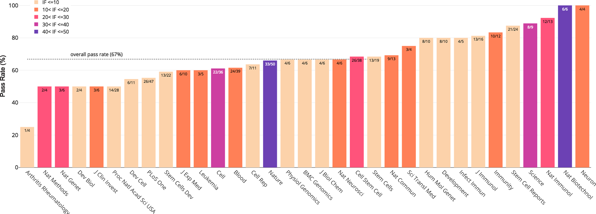

Stemformatics includes curated ‘collections’ of data relevant to cell reprogramming, as well as hematopoiesis and leukaemia. Rather than simply rehosting datasets as they appear in public repositories, Stemformatics uses a stringent set of quality control metrics and its own pipelines to process handpicked datasets from raw files.



*Percentage of datasets passing quality control for journal of publication (not all journals are shown). Numbers on each bar indicate the number of passed/total datasets and colours indicate the impact factor range of the journal.*

[Online version](https://doi.org/10.1093/nar/gky1064)

[Download paper here](http://tyronechen.github.io/files/gky1064.pdf)

Plain text citation:

Jarny Choi, Chris M Pacheco, Rowland Mosbergen, Othmar Korn, Tyrone Chen, Isha Nagpal, Steve Englart, Paul W Angel, Christine A Wells, &quot;Stemformatics: visualize and download curated stem cell data.&quot; <i>Nucleic Acids Research</i>, Volume 47, Issue D1, 08 January 2019, Pages D841–D846. DOI: https://doi.org/10.1093/nar/gky1064

Bibtex citation:

```
@article{10.1093/nar/gky1064,
    author = {Choi, Jarny and Pacheco, Chris M and Mosbergen, Rowland and Korn, Othmar and Chen, Tyrone and Nagpal, Isha and Englart, Steve and Angel, Paul W and Wells, Christine A},
    title = "{Stemformatics: visualize and download curated stem cell data}",
    journal = {Nucleic Acids Research},
    volume = {47},
    number = {D1},
    pages = {D841-D846},
    year = {2018},
    month = {11},
    issn = {0305-1048},
    doi = {10.1093/nar/gky1064},
    url = {https://doi.org/10.1093/nar/gky1064},
    eprint = {https://academic.oup.com/nar/article-pdf/47/D1/D841/27437452/gky1064.pdf},
}
```
