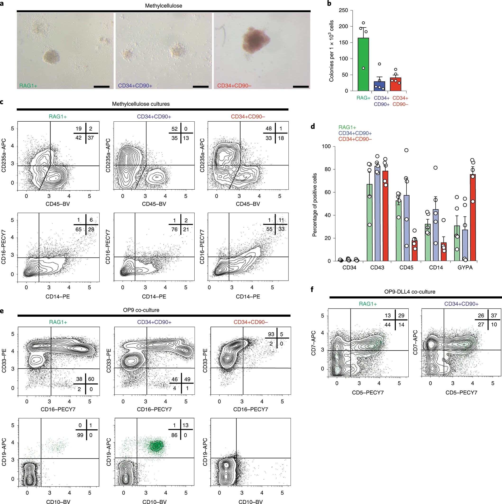

We provide evidence for a wave of human T-cell development that originates directly from haemogenic endothelium via a RAG1+ intermediate with multilineage potential.



[Online version](https://rdcu.be/b440v)

[Download paper here](http://tyronechen.github.io/files/s41556-019-0445-8.pdf)

Plain text citation:

Ali Motazedian, Freya F. Bruveris, Santhosh V. Kumar, Jacqueline V. Schiesser, Tyrone Chen, Elizabeth S. Ng, Ann P. Chidgey, Christine A. Wells, Andrew G. Elefanty, Edouard G. Stanley, &quot;Multipotent RAG1+ progenitors emerge directly from haemogenic endothelium in human pluripotent stem cell-derived haematopoietic organoids.&quot; <i>Nat Cell Biol</i> 22, 60–73 (2020). DOI: https://doi.org/10.1038/s41556-019-0445-8

Bibtex citation:
```
@article{Motazedian2020,
	author = {Motazedian, Ali and Bruveris, Freya F. and Kumar, Santhosh V. and Schiesser, Jacqueline V. and Chen, Tyrone and Ng, Elizabeth S. and Chidgey, Ann P. and Wells, Christine A. and Elefanty, Andrew G. and Stanley, Edouard G.},
	doi = {10.1038/s41556-019-0445-8},
	isbn = {4155601904458},
	issn = {14764679},
	journal = {Nature Cell Biology},
	number = {January},
	publisher = {Springer US},
	title = {{Multipotent RAG1+ progenitors emerge directly from haemogenic endothelium in human pluripotent stem cell-derived haematopoietic organoids}},
	url = {http://dx.doi.org/10.1038/s41556-019-0445-8},
	volume = {22},
	year = {2020}
}
```
