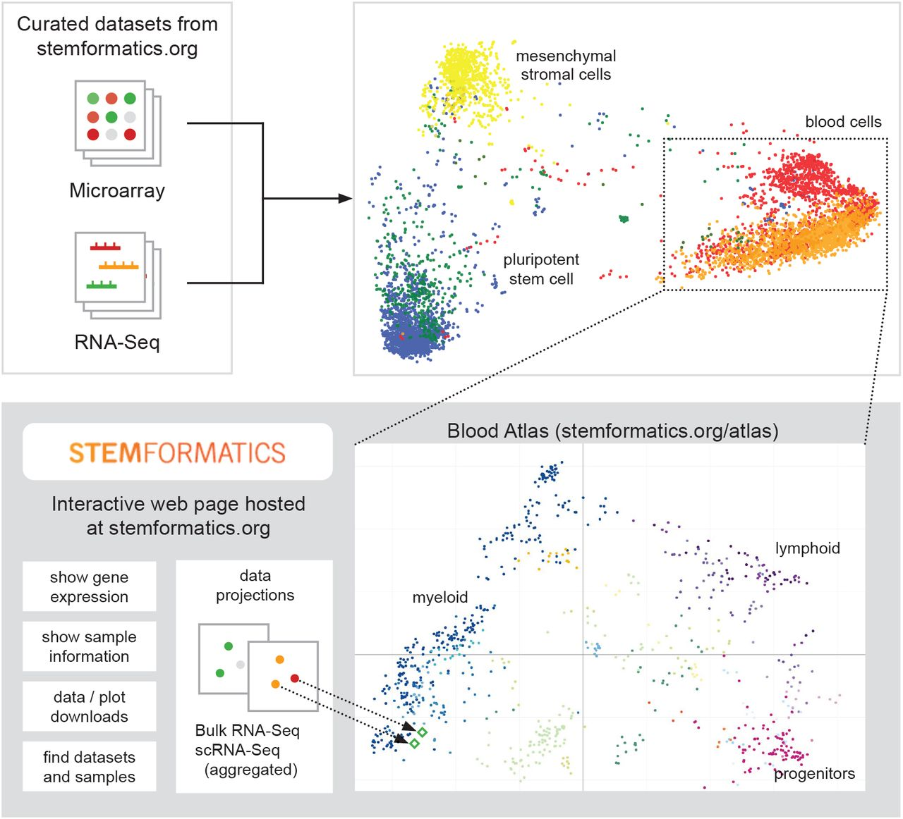

We demonstrate that it is possible to combine a large number of different profiling experiments summarised from dozens of laboratories and representing hundreds of donors, to create an integrated molecular map of human tissue.



[Online version](https://doi.org/10.1371/journal.pcbi.1008219)

[Download paper here](https://journals.plos.org/ploscompbiol/article/file?id=10.1371/journal.pcbi.1008219&type=printable)

Plain text citation:

Paul W Angel, Nadia Rajab, Yidi Deng, Chris M Pacheco, Tyrone Chen, Kim-Anh Lê Cao, Jarny Choi, Christine A Wells, &quot;A simple, scalable approach to building a cross-platform transcriptome atlas.&quot; <i>PLoS computational biology</i>, 16.9 (2020): e1008219. DOI: https://doi.org/10.1371/journal.pcbi.1008219


Bibtex citation:
```
@article{angel2020simple,
  title={A simple, scalable approach to building a cross-platform transcriptome atlas},
  author={Angel, Paul W and Rajab, Nadia and Deng, Yidi and Pacheco, Chris M and Chen, Tyrone and L{\^e} Cao, Kim-Anh and Choi, Jarny and Wells, Christine A},
  journal={PLoS computational biology},
  volume={16},
  number={9},
  pages={e1008219},
  year={2020},
  publisher={Public Library of Science San Francisco, CA USA}
}
```
