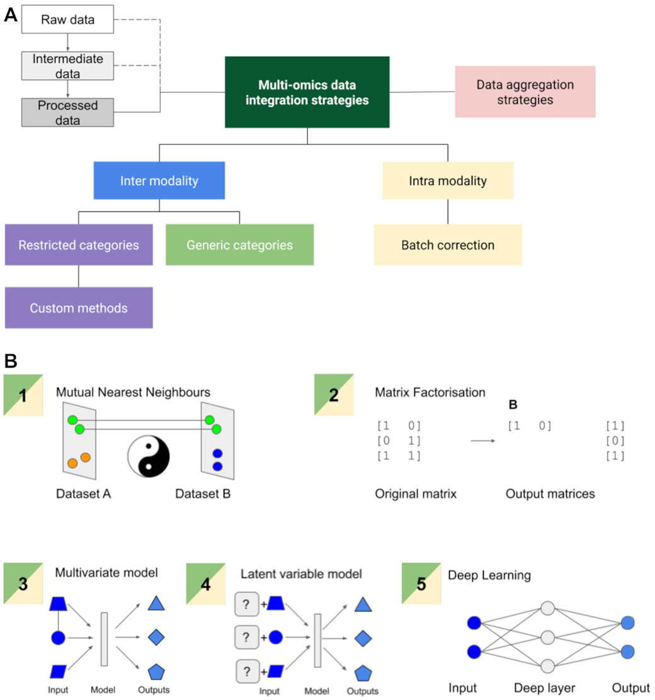

In this review, we perform a critical analysis of methods with the explicit aim of harmonising data, as opposed to case-specific integration. This revealed that matrix factorisation, latent variable analysis, and deep learning are potent strategies. Finally, we describe the properties of an ideal universal data harmonisation framework.



[Online version](http://dx.doi.org/10.1093/gigascience/giaa064)

[Download paper here](http://tyronechen.github.io/files/giaa064.pdf)

Plain text citation:

Tyrone Chen, Sonika Tyagi, &quot;Integrative computational epigenomics to build data-driven gene regulation hypotheses.&quot; <i>GigaScience</i>, Volume 9, Issue 6, June 2020, giaa064. DOI: https://doi.org/10.1093/gigascience/giaa064

Bibtex citation:
```
@article{10.1093/gigascience/giaa064,
    author = {Chen, Tyrone and Tyagi, Sonika},
    title = "{Integrative computational epigenomics to build data-driven gene regulation hypotheses}",
    journal = {GigaScience},
    volume = {9},
    number = {6},
    year = {2020},
    month = {06},
    issn = {2047-217X},
    doi = {10.1093/gigascience/giaa064},
    url = {https://doi.org/10.1093/gigascience/giaa064},
    note = {giaa064},
    eprint = {https://academic.oup.com/gigascience/article-pdf/9/6/giaa064/33393761/giaa064.pdf},
}
```
