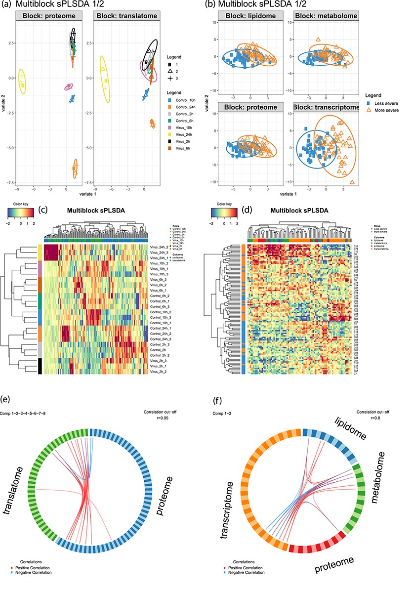

We demonstrate with two independent case studies that our multi-modal data harmonisation pipeline easily generates a list of pertinent biological features for downstream analyses without using algorithms specifically tailored to the datasets.



[Online version](https://doi.org/10.1093/bib/bbab185)

[Download paper here](http://tyronechen.github.io/files/bbab185.pdf)

Plain text citation:

Tyrone Chen, Melcy Philip, Kim-Anh Lê Cao, Sonika Tyagi, &quot;A multi-modal data harmonisation approach for discovery of COVID-19 drug targets.&quot; <i>Briefings in Bioinformatics</i>, May 2021, bbab185. DOI: https://doi.org/10.1093/bib/bbab185

Bibtex citation:
```
@article{10.1093/bib/bbab185,
    author     = {Chen, Tyrone and
                  Philip, Melcy and
                  Lê Cao, Kim-Anh and
                  Tyagi, Sonika},
    title      = "{A multi-modal data harmonisation approach
                   for discovery of COVID-19 drug targets}",
    journal    = {Briefings in Bioinformatics},
    year       = {2021},
    month      = {05},
    issn       = {1477-4054},
    doi        = {10.1093/bib/bbab185},
    url        = {https://doi.org/10.1093/bib/bbab185},
    note       = {bbab185},
    eprint     = {https://academic.oup.com/bib/advance-article-pdf/doi/10.1093/bib/bbab185/38130519/bbab185.pdf},
}
```
