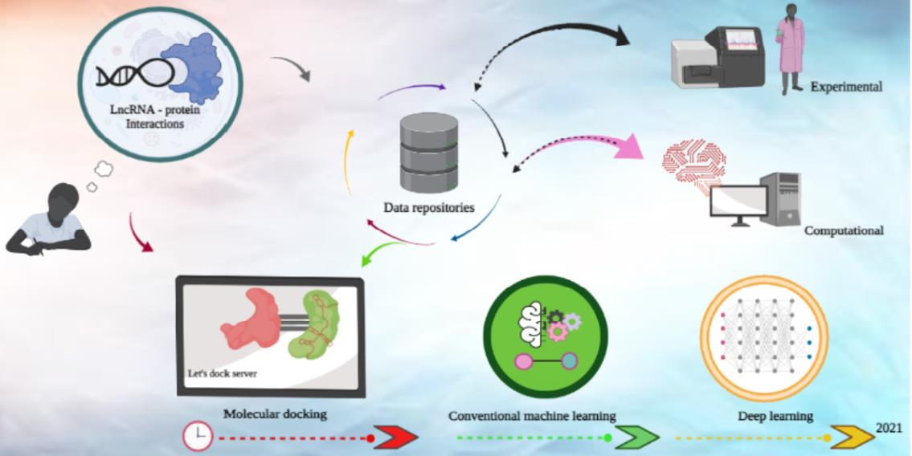

We reviewed the current state of the art in lncRNA-protein interactions (LPI). We specifically surveyed recent computational methods and databases which researchers can exploit for LPI investigation.



[Online version](https://doi.org/10.3390/ncrna7020033)

[Download paper here](http://tyronechen.github.io/files/ncrna-07-00033-v2.pdf)

Plain text citation:

Melcy Philip, Tyrone Chen, Sonika Tyagi, &quot;A Survey of Current Resources to Study lncRNA-Protein Interactions.&quot; <i>Non-Coding RNA</i>, June 2021, Volume 7, Issue 2. DOI: https://doi.org/10.3390/ncrna7020033

Bibtex citation:
```
@article{philip2021survey,
  title={A Survey of Current Resources to Study lncRNA-Protein Interactions},
  author={Philip, Melcy and Chen, Tyrone and Tyagi, Sonika},
  journal={Non-Coding RNA},
  volume={7},
  number={2},
  pages={33},
  year={2021},
  publisher={Multidisciplinary Digital Publishing Institute}
}
```
