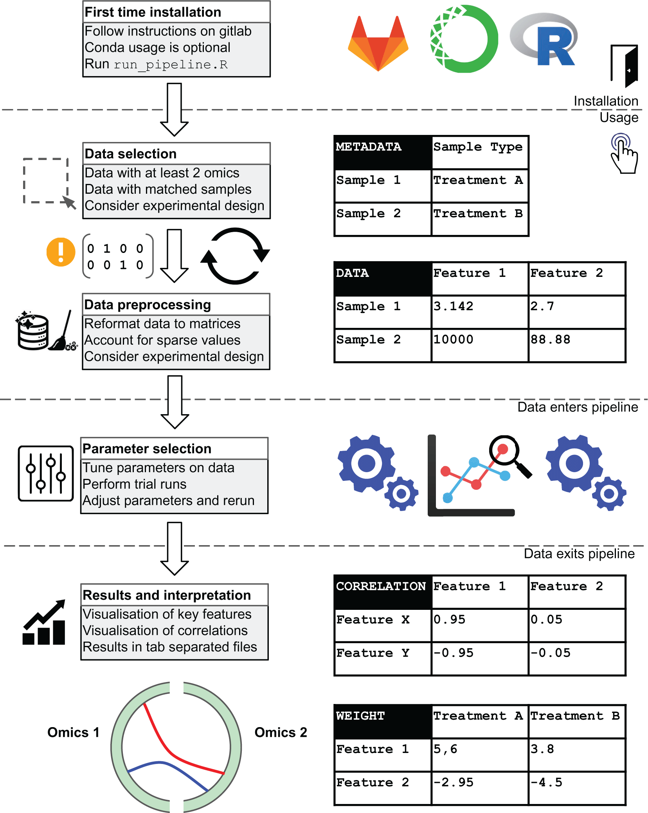

We present our R `multiomics` pipeline as an easy to use and flexible pipeline that takes unrefined multi-omics data as input, sample information and user-specified parameters to generate a list of output plots and data tables for quality control and downstream analysis.



[Online version](https://doi.org/10.12688/f1000research.53453.1)

[Download paper here](http://tyronechen.github.io/files/f1000_multiomics.pdf)

Plain text citation:

Tyrone Chen, Al J Abadi, Kim-Anh Lê Cao, Sonika Tyagi, &quot;multiomics: A user-friendly multi-omics data harmonisation R pipeline [version 1; peer review: awaiting peer review]&quot; <i>F1000Research<\i> July 2021, 10:538. DOI: https://doi.org/10.12688/f1000research.53453.1

Bibtex citation:
```
@article{chen2021multiomics,
  title={multiomics: A user-friendly multi-omics data harmonisation R pipeline},
  author={Chen, Tyrone and Abadi, Al J and L{\^e} Cao, Kim-Anh and Tyagi, Sonika},
  journal={F1000Research},
  volume={10},
  number={538},
  pages={538},
  year={2021},
  publisher={F1000 Research Limited}
}
```
