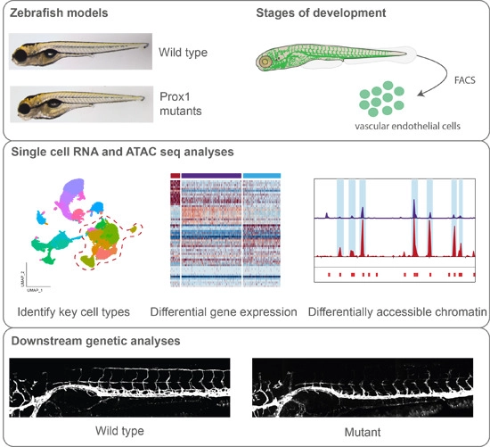

We here present a single-cell transcriptomic atlas of lymphangiogenesis in zebrafish, revealing new markers and hallmarks of LEC differentiation over four developmental stages.



[Online version](https://doi.org/10.15252/embj.2022112590)

[Download paper here](http://tyronechen.github.io/files/emboj2022112590.pdf)

Plain text citation:

Lin Grimm, Elizabeth Mason, Hujun Yu, Stefanie Dudczig, Virginia Panara, Tyrone Chen, Neil I Bower, Scott Paterson, Maria Rondon Galeano, Sakurako Kobayashi, Anne Senabouth, Anne K Lagendijk, Joseph Powell, Kelly A Smith, Kazuhide S Okuda, Katarzyna Koltowska, Benjamin M Hogan; Single-cell analysis of lymphatic endothelial cell fate specification and differentiation during zebrafish development; The EMBO Journal (2023) e112590. DOI: https://doi.org/10.15252/embj.2022112590

Bibtex citation:
```
@article{https://doi.org/10.15252/embj.2022112590,
  author = {Grimm, Lin and Mason, Elizabeth and Yu, Hujun and Dudczig, Stefanie and Panara, Virginia and Chen, Tyrone and Bower, Neil I and Paterson, Scott and Rondon Galeano, Maria and Kobayashi, Sakurako and Senabouth, Anne and Lagendijk, Anne K and Powell, Joseph and Smith, Kelly A and Okuda, Kazuhide S and Koltowska, Katarzyna and Hogan, Benjamin M},
  title = {Single-cell analysis of lymphatic endothelial cell fate specification and differentiation during zebrafish development},
  journal = {The EMBO Journal},
  volume = {n/a},
  number = {n/a},
  pages = {e112590},
  keywords = {lymphangiogenesis, lymphatics, Notch1, Prox1, Vegfc single-cell sequencing},
  doi = {https://doi.org/10.15252/embj.2022112590},
  url = {https://www.embopress.org/doi/abs/10.15252/embj.2022112590},
  eprint = {https://www.embopress.org/doi/pdf/10.15252/embj.2022112590},
}
```
