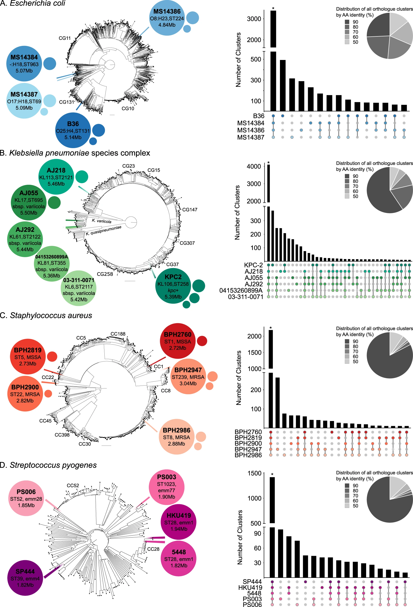

The collaborative consortium took on the challenging task of producing and integrating multi-omics datasets generated from key clinical sepsis pathogens from Australia and globally, to support discovery and translational research to tackle the global challenge in the rise of antimicrobial resistance.



[Online version](https://doi.org/10.1038/s41467-023-37200-w)

[Download paper here](http://tyronechen.github.io/files/natcomms_bpa_sepsis.pdf)

Plain text citation:

Mu, A., Klare, W.P., Baines, S.L. et al. Integrative omics identifies conserved and pathogen-specific responses of sepsis-causing bacteria. Nat Commun 14, 1530 (2023). DOI: https://doi.org/10.1038/s41467-023-37200-w

Bibtex citation:
```
@article{mu2023integrative,
  title={Integrative omics identifies conserved and pathogen-specific responses of sepsis-causing bacteria},
  author={Mu, Andre and Klare, William P and Baines, Sarah L and Ignatius Pang, CN and Gu{\'e}rillot, Romain and Harbison-Price, Nichaela and Keller, Nadia and Wilksch, Jonathan and Nhu, Nguyen Thi Khanh and Phan, Minh-Duy and others},
  journal={Nature Communications},
  volume={14},
  number={1},
  pages={1530},
  year={2023},
  publisher={Nature Publishing Group UK London},
  doi = {https://doi.org/10.1038/s41467-023-37200-w},
  url = {https://doi.org/10.1038/s41467-023-37200-w},
  eprint = {https://doi.org/10.1038/s41467-023-37200-w}
}
```
